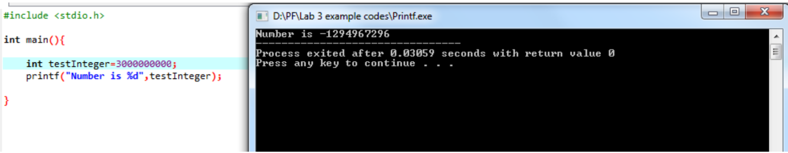
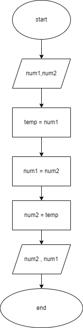
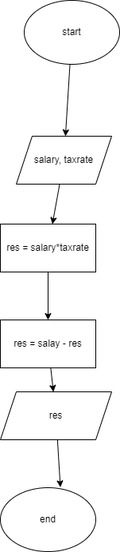
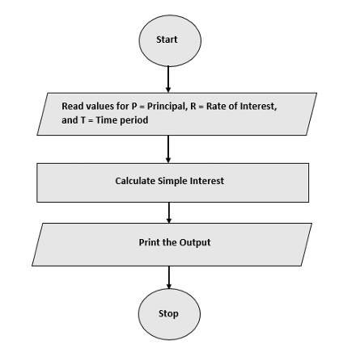
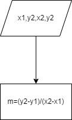

# QUESTION#1

Explain the output of this C program. Why the wrong value is being displayed in the output?


## Answer #1

- in C, integers are stored in 16 bits which the current value is greater than, hence being an unsigned integer causes the overflow to rewritten in the identifier
- to fix this, use a long datatype to allocate more space (32 bits) to the value

```c
#include <stdio.h>
int main(){
    long testInteger = 30000000000;
    printf("number is %ld", testInteger);
    return 0;
}
```

# QUESTION#2

Write a C program that takes two integer values as input from the user. Then swap the values taken from the user and display the output of the variables. 

## Answer #2

### Answer-2-flowchart



### Answer-2-pseudocode

```
input num1, num2
temp = num1
num1 = num2
num2 = temp
print(num2,num1)
```

### Answer-2-C-code

```c
//start

// adding lib
#include <stdio.h>

// start main code
int main(){
    
    // declaration
    int num1, num2, temp;

    // taking input

    // first num
    printf("enter num1:\n");
    scanf("%d",&num1);

    // second num
    printf("enter num2:\n");
    scanf("%d",&num2);
    
    // showcase initial values
    printf("first num1 is: %d \n and num2 is: %d\n", num1, num2);
    
    // swap of values
    temp = num1;
    num1 = num2;
    num2 = temp;
    // showcasing the results
    printf("now num1 is: %d \n and num2 is: %d\n", num1, num2);
    return 0;
}
//end

```

# QUESTION#3

A customer asks the IT firm to develop a program in C language, which can take tax rate and salary from the user on runtime and then calculate the tax, the user has to pay and the salary he/she will have after paying the tax. This information is then provided to the user.  

### Answer-3-flowchart



### Answer-3-pseudocode

```
input taxRate, salary
final = taxrate*salary
salary = salary -final
print (salary)
print (final)
```

### Answer-3-C-code

```c
//start

// adding lib
#include <stdio.h>

// start main code
int main(){
    
    // declaration
    int final, taxrate, salary;

    // taking input

    // salary
    printf("enter taxrate in percentage (for example: 50 percent):\n");
    scanf("%d",&taxrate);
    while (taxrate>100){
        printf("value cannot be greater than 100!\ntry again:");
        scanf("%d",&taxrate);
    }
    taxrate = 100 - taxrate;
    // taxrate
    printf("enter salary:\n");
    scanf("%d",&salary);
    
    // now the user will enter the salary he receives after tax deduction

    final = taxrate*salary/100;
    printf("your initial salary: %d \n",salary); 
    printf("your final salary : %d \n",final);
    return 0;
}
//end
```

# QUESTION#4

A car travelled back and forth from point A to point B. With a distance being (single trip) 1207KM. During the forward trip fuel price was 118/liter while returning it was 123/liter. Calculate the total fuel cost (both ways) and the fuel consumed (total trip). Use the car’s fuel average as input from the user (Input must be positive make some restrictions on only accepting positive input)

### Answer-4-flowchart


### Answer-4-pseudocode

### Answer-4-C-code

# QUESTION#5

Construct a C program with the flowchart below. The input value of the principle must be between 100 Rs. To 1,000,000 Rs. The Rate of interest must be between 5% to 10% and Time Period must be between 1 to 10 years.Hint: these restrictions can be displayed in the form of message on the window.



### Answer-5-pseudocode

### Answer-5-C-code

# QUESTION#6
Construct a C program where you calculate the slope of two point (5,4), (3,2). Use format specifiers to cap the result to 3 decimal places.

### Answer-6-flowchart

)

### Answer-6-pseudocode

```
input x1,x2,y1,y2
m = (y2-y1)/(x2-x1)
```


### Answer-6-C-code

```c
//start

// adding lib
#include <stdio.h>

// start main code
int main(){
    
    // declaration
    int x1, x2, y1,y2;
    float m;

    // taking input

    // x1
    printf("enter x1:\n");
    scanf("%d",&x1);
    
    // x2
    printf("enter x2:\n");
    scanf("%d",&x2);
    
    // y1
    printf("enter y1:\n");
    scanf("%d",&y1);
    
    // y2
    printf("enter y2:\n");
    scanf("%d",&y2);

    m = (x2-x1)/(y2-y1);
    printf("slope is: %.3f",m);
    
    return 0;
}
//end
```