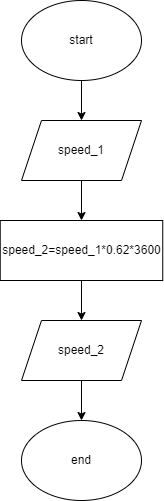

# Problem 1: Miles per hour to kilometers per seconds

This year olympics were held in Europe causing all sorts of problems for the Americans as they don’t use the standard measures like meters and kilometers, grams and kilograms. For racing events the speeds are measured in kilometers per seconds. Can you design a solution to convert kilometers per seconds to miles per hour for US viewers of the Paris Olympics?

## IPO Chart

### Input

- speed in kilometers per second or kmps or 3600 kmph

### process

- convert speed in kmph to speed in miles per hour or mph

### output

- speed in mph

|Input|process|output|
|-|-|-|
|speed in kilometers per sec or 3600 kmph|convert speed in kmph to speed in miles per hour or mph|speed in mph|

## Flowchart



## Pseudocode

- 1 km = 0.62miles
- 1 km/h = 0.62mi/h
- x km/h = 0.62x mi/h

Hence, for x kmph, mph is 3600\*0.62\*x

```pseudocode
input speed_1

speed_2 = speed_1*0.62*3600

output speed_2

```
