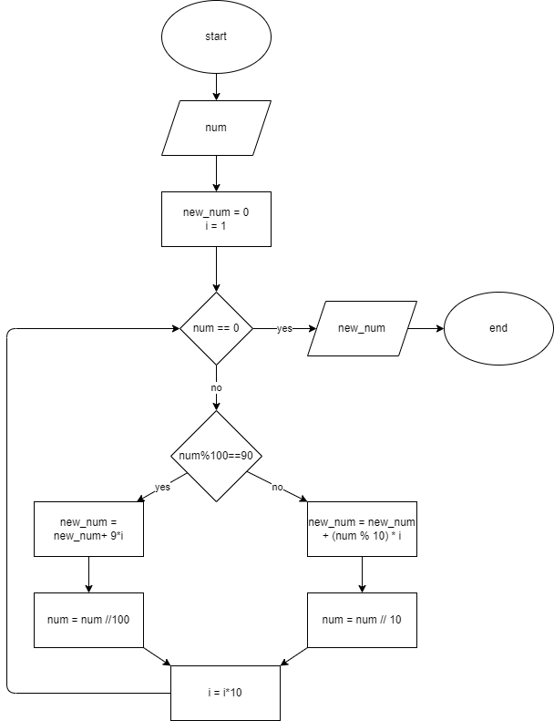

# Problem 10: Poor Mr. Bhoola bought a faulty keyboard

Imagine Mr. Bhoola's keyboard is a bit mischievous! Every time he types the number "9," the keyboard adds an extra zero.  So, if he types "9," it shows up as "90".  
Your Mission:
Mr. Bhoola wrote down some numbers using his silly keyboard.  But we know they're wrong because of the extra zeroes.  Your job is to fix them by taking away the extra zeroes whenever you see a "90" in the number.
Here are some examples:

- 100900:  The keyboard typed "90" where there should be "9".  So, it's really 10090.
- 1540090:  The keyboard added an extra zero again.  It's really 154009.
- 1290905:  This one is tricky!  There's a "90" where there should be a "9".  It's really 12995.

Design a solution to fix the other numbers Mr. Bhoola wrote down!

## LOGIC

- replace all 90s with 9
- use `mod 100` to get the last 2 digits of number
- if not 90, then `mod 10` to get the last digit
- collect the last digit in a new_num with increasing powers to ten
- for example,
==31212== mod 10 = 2= 2\*1 + 0 = 2, 31212 div 10 =3121
    3121 mod 10 = 1= 1\*10 + 1 = 12, 3121 div 10 = 312
    312 mod 10 = 2= 2\*100 + 12 = 212, 312 div 10 = 31
    31 mod 10 = 1= 1\*1000 + 212 = 1212, 31 div 10 = 3
3 mod 10 = 3= 1\*10000 + 1212 = ==31212==, 3 div 10 =0 , when `num div 10 = 0` stop the loop

- the increasing power of ten is `index`

- now if we perform `mod 100` before `mod 10` then we will check for `90`
- if found instead of `mod 10` to get last digit and multiplying it with the `index` we will `new_num = new_num + 9*i` instead of `new_num = new_num + (num%10)*i`
- then `div 100` instead of `div 10`
- for example,

329012 mod 100 = 12
329012 mod 10 = 2*1 + 0 = 2
329012 div 10 = 32901

32901 mod 100 = 1
32901 mod 10 = 1***10**+2 = 12
32901 div 10 = 3290

3290 mod 100 = 90
9***100** + 12 = 912
3290 div 100 = 32

32 mod 100 = 32
32 mod 10 = 2***1000** + 912 = 2912
32 div 10 = 3

3 mod 100 = 3
3 mod 10 = 3***10000** + 2912 = 32912
3 div 10 = 0 `stop`

## pseudocode

```pseudocode

input num
new_num = 0

i=1

while num != 0:
    if num % 100 == 90:
        new_num = new_num + 9*i
        num = num // 100
    else:
        new_num = new_num + (num%10)*i
        num = num // 10
    i = i * 10
    endif
endwhile

```

## IPO Chart
|input|process|output|
|-|-|-|
|faulty number| detect all 90s and replace with 9| corrected number|

## Flowchart

