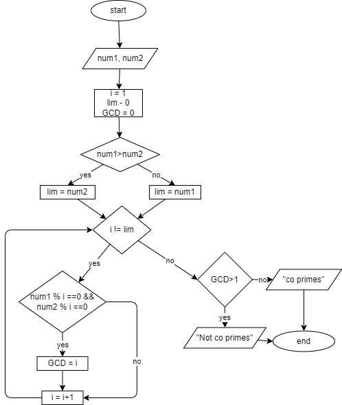

# Problem 11: No not optimus prime its Coprime

Mr. Bhoola just found out about coprime numbers. Now he is obsessed with them and keeps checking two numbers whether they are coprime or not. You are to design a solution to this problem and help Mr. Bhoola with checking whether any two whole numbers greater than 0 are coprime or not.
A simplified definition of Coprime numbers is that their GCD is 1. You are encouraged to check wiki or other resources for more information.

Examples:
8 and 9 are coprimes despite the fact that they are not prime numbers.
14 and 33 are coprimes.

## LOGIC

- divide both numbers with an index,
- if both are divisible by the same index they are not co primes and their GCD is not 1
- run the loop until index is greater than the smaller input

## pseudocode

```pseudocode

input num1
input num2

i=1
lim = 0

GCD = 0

if num1>num2:
    lim = num2
else:
    lim = num1

while i != lim:
    if num1 % i == 0 && num2 % i == 0:
        GCD = i
    endif
    i = i + 1
endwhile

if GCD>1:
    print "not co primes"

```

## IPO Chart

|input|process|output|
|-|-|-|
|num1 num2| check whether all numbers less than the smaller input are divisible with both|if not then "co primes", else "not co primes"|

## Flowchart

