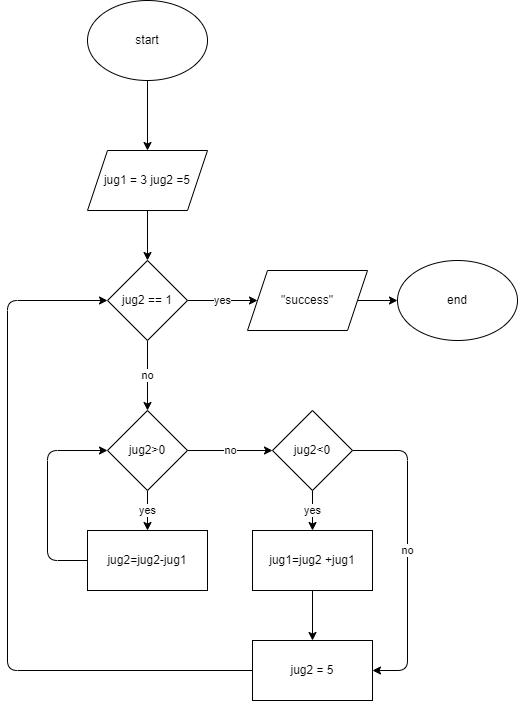

# Problem 12: Die Hard 3: Defuse the bomb… Quick

You've got to defuse a bomb by placing exactly 4 liters of water on a sensor. And you have to be quick! The problem is, you only have a 5L jug and a 3L jug on hand!
See the video clip here: <https://youtu.be/BVtQNK_ZUJg>
You have an unlimited water source, and if needed you can also empty the water in the jugs to get rid of it.
How could 4 liters be measured?

## LOGIC

- fill 5L_jug with 3L_jug 2 times,
- 5L_jug is full and 1L is remaining in 3L_jug
- empty 5L_jug
- pour 1L in 5L_jug from 3L_jug
- fill 3L_jug
- empty it in 5L_jug
- now 5L_jug has 4L

3+3 = 6
6-5 = 1
1+3 = 4

operations on 5L_jug: +3, -3, +5, -5
operations on 3L_jug: +3, -3

```pseudocode

n=5
m=3

jug1 = n  // space available
jug2 = m  // space available

while jug1 != n-4: // all the operations below will be performed iteratively until the space in jug1 is not n-4 where n = space in jug1 i.e 5
    while jug1>0:
        jug1 = jug1 - jug 2 
        // jug1 = 5-3 =2 -> space available in jug1

    // jug1 = 2-3 = -1 -> space available in jug1 as in overflow

    if jug1 < 0: 
        jug2=jug1+jug2 // 2=-1+3

    jug1 = n // jug1 is now emptied, space is now back to default


```

## IPO Chart

|input|process|output|
|-|-|-|
|jug1 space, jug2 space, amount desired | perform an iterative process of filling the larger jug with smaller jug and and its contents until the condition is met| the desired amount of water|

## flowchart


