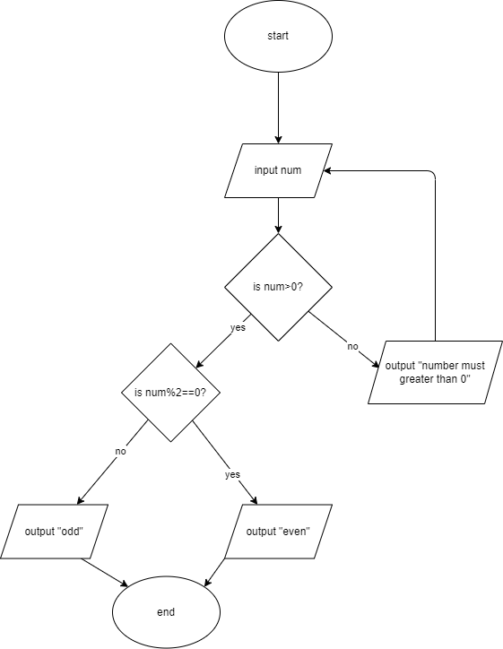

# Problem 2: Even or Odd

Mr. Bhola does not know what an even or odd number is. He is least bothered to learn the difference either. It all comes down to your programming skills to design a program that will ask for a positive number greater than 0 and prints whether the number is even or odd. Be careful, Mr. Bhola can even enter 0 or negative numbers so your solution must give an error saying invalid input in that case.  

## IPO Chart

|input|process|output|
|-|-|-|
|num|if num%2 == 0, print 'even' else print 'odd'| print statement|

## Flowchart



## pseudocode

```pseudocode

input num1

while num<1:
    print "error wrong input, try again"
    print num1

if num%2==0:
    print "even"
else:
    print "odd"

```
