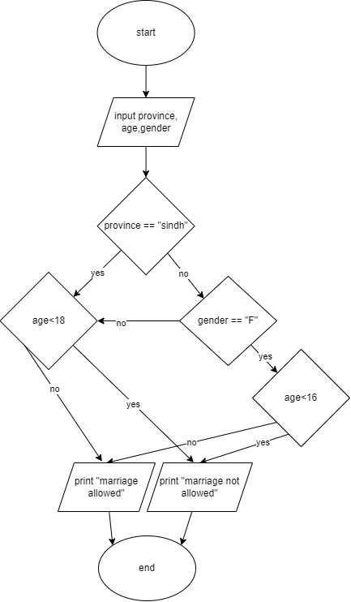

# Problem 3: Legal age of marriage in Pakistan

Child marriages are a major problem in Pakistan. To avoid responsibility the Federal Government delegated the task of Child Marriage Laws to provinces. Only Punjab and Sindh have updated the laws while in Punjab the law is going under another amendment this year. To make things simple in Sindh, No child, girl or boy, below the age of 18 can marry. Whereas in Punjab (until the new bill is passed) and other provinces ACT of 1929 is followed which prohibits girls below the age of 16 to marry whereas for boys the age is 18.
You are required to  design a solution  for both provinces to make this decision easy by asking relevant information from the user and giving output whether it is legal to marry to or not.

## IPO Chart

|input|process|output|
|-|-|-|
|province,age,gender|compare age and gender to province to give results for that respective province|print "marriage allowed", or print "marriage not allowed"|

## pseudocode

```pseudocode

input province, gender, age

if province <> "sindh":
    if gender == "F":
        if age <16:
            print "marriage not allowed"
        else:
            print " marriage allowed"
    else:
        if age<18:
            print "marriage not allowed"
        else:
            print " marriage allowed"
else:
    if age<18:
        print "marriage not allowed"

```

## flowchart


