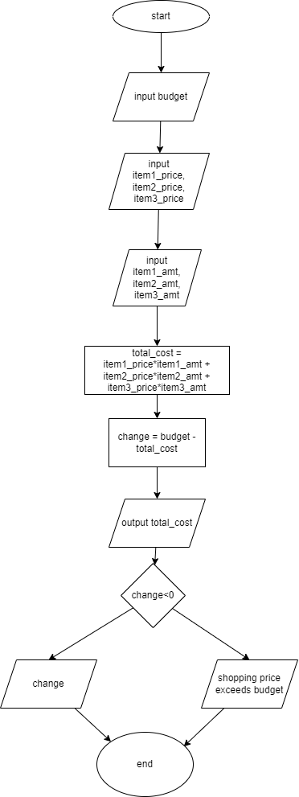

# Problem 4: Grocery Assistance/ Calculator

Imagine Mr. Bhoola is going to the market to buy some yummy fruits and vegetables. He's a little bit forgetful, so he doesn't always have a list or a fixed amount of money to spend. We're going to help Mr. Bhoola figure out how much he needs to pay and how much change he gets back.
Here's what we need to know:

- How much money Mr. Bhoola has today to buy fruits and vegetables.
- The prices of the onions, apricots, grapes, and tomatoes at the market.
- What vegetables Mr. Bhoola buys and how many of each.

Here is an example of some random day in life of Mr. Bhoola

1. What fruits and vegetables does Mr. Bhoola buy today?
(For example, 2kg onions, 1 kg of grapes, and 3kg tomatoes)
2. What are the prices of each vegetable today?
(For example, onions cost \$1 per kg, grapes cost \$2 per kg, and tomatoes cost $0.50 per kg)
3. How much money does Mr. Bhoola have with him ?
(For example, $10)
Design a solution to help Mr. Bhoola every time he goes shopping!


## pseudocode

```pseudocode

input budget
input item1, item2, item3
input item1_price, item2_price, item3_price
input item1_amt, item2_amt, item3_amt

total_cost = item1_price*item1_amt + item2_price*item2_amt + item3_price*item3_amt

change = budget - total_cost


print "total cost is: ", total_cost
if change<0:
    print "shopping price exceeds budget"

else:
    print "amount remaining is: ", change


```

## IPO Chart

|input|process|output|
|-|-|-|
|price of items, amount of items, budget|calculating total cost of all the items, change remaining|change, total cost|

## Flowchart


