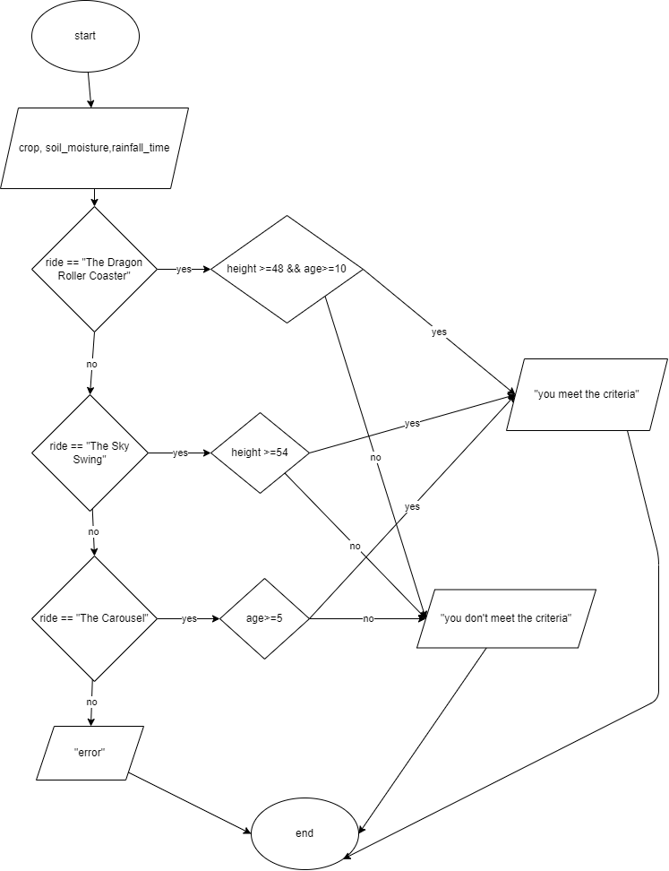

# Problem 6: Amusement Park Ride eligibility

Safari park is a famous amusement park situated in Karachi that has specific height and age requirements for its rides.
For The Dragon Roller Coaster, visitors must be at least 48 inches tall and 10 years old.
The Sky Swing requires visitors to be at least 54 inches tall, with no age restriction.
The Carousel has no height requirement but visitors must be at least 5 years old.  
A visitor is wearing a band so he may take as many rides as he wants until he is tired.
Design a  solution that determines if a visitor meets the criteria to go on a chosen ride based on their height, age, and selected ride.
Examples:

Input:

- Height: 55 inches
- Age: 10 years
- Ride: "The Carousel"

Expected Output:
"You meet the criteria for The Carousel."

Input:

- Height: 48 inches
- Age: 9 years
- Ride: "The Dragon Roller Coaster"

Expected Output:
"Sorry, you do not meet the criteria for The Dragon Roller Coaster."

## Pseudocode

```Pseudocode

input ride, height, age

switch(ride){

    case "The Dragon Roller Coaster":
        if height >=48 && age>=10:
            print "you meet the criteria for The Dragon Roller Coaster"
        else:
            print "Sorry, you do not meet the criteria for The Dragon Roller Coaster"
    case "The Sky Swing":
        if height >=54 :
            print "you meet the criteria for The Sky Swing"
        else:
            print "Sorry, you do not meet the criteria for The Sky Swing"
    case "The Carousel":
        if age>=5:
            print "you meet the criteria for The Carousel"
        else:
            print "Sorry, you do not meet the criteria for The Carousel"
    default:
        print "incorrect input"
}


```

## IPO Chart

|input|process|output|
|-|-|-|
|ride,height,age|use of decision boxes to check eligibilty criteria|"you meet the criteria" or "you do not meet the criteria"|


## flowchart

