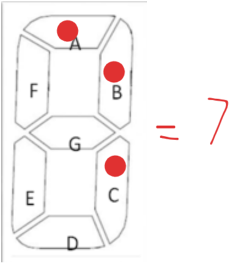

# Problem 7: Which floor…

There are 10 floors in a building 0 to 9. The building lift/elevator has a 1 digit, 7 segment LCD Panel display to tell which floor the lift is on, as shown. The input into the LCD Panel is a 7-digit long number with only 1s and 0s. Each digit of the 7-digit long number tells which panel to light or not to light from A to G respectively, where 1 means to light the panel and 0 means to keep it off.  

E.g., 0110000 means only panel ‘B’ and ‘C’ are lit thus telling that this is the first floor. Similarly, the number 1111110 tells that all panels are lit except panel ‘G’ displaying the number 0.

You need to design a program for a computer surveillance system to tell which floor the lift is on. The input for the program is the 7-digit number comprising only 1s and 0s. The output should be a single digit number  0 to 9 telling which floor the lift is on.
Hint: You can get the last digit by using %10 and the remaining digits by using number division /10.  Also, you only need branching to do it.


## LOGIC


|A|B|C|D|E|F|G|
|-|-|-|-|-|-|-|
|1|1|1|1|1|1|0|

---


|A|B|C|D|E|F|G|
|-|-|-|-|-|-|-|
|0|1|1|0|0|0|0|

---


|A|B|C|D|E|F|G|
|-|-|-|-|-|-|-|
|1|1|0|1|1|0|1|

---


|A|B|C|D|E|F|G|
|-|-|-|-|-|-|-|
|1|1|1|1|0|0|1|

---


|A|B|C|D|E|F|G|
|-|-|-|-|-|-|-|
|0|1|1|0|0|1|1|

---


|A|B|C|D|E|F|G|
|-|-|-|-|-|-|-|
|1|0|1|1|0|1|1|

---


|A|B|C|D|E|F|G|
|-|-|-|-|-|-|-|
|1|0|1|1|1|1|1|

---



|A|B|C|D|E|F|G|
|-|-|-|-|-|-|-|
|1|1|1|0|0|0|0|

---


|A|B|C|D|E|F|G|
|-|-|-|-|-|-|-|
|1|1|1|1|1|1|1|

---


|A|B|C|D|E|F|G|
|-|-|-|-|-|-|-|
|1|1|1|0|0|1|1|

---

## Pseudocode

`ABCDEFG`

`1111110` = `0`
`0110000` or `110000` = `1`
`1101101` = `2`
`1111001` = `3`
`0110011` or `110011` = `4`
`1011011` = `5`
`1011111` = `6`
`1110000` = `7`
`1111111` = `8`
`1110011` = `9`

``` Pseudocode
input code

switch (code){
    case 1111110:
        print "0"
        break
    case 110000:
        print "1"
        break
    case 1101101:
        print "2"
        break
    case 1111001:
        print "3"
        break
    case 110011:
        print "4"
        break
    case 1011011:
        print "5"
        break
    case 1011111:
        print "6"
        break
    case 1110000:
        print "7"
        break
    case 1111111:
        print "8"
        break
    case 1110011:
        print "9"
        break
    default:
        print "error"
        break
    
}

```

## IPO Chart

|input|process|output|
|-|-|-|
|7 digit number|case switching| number from 0 to 9|

## Flowchart


