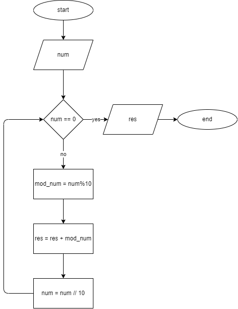

# Problem 8: Digit Sum

You are required to design a solution  that takes as input a single number and prints out the sum of its digits. Check the examples below for clarity.
Examples:
sumDigit(345) = 12
sumDigit(1) = 1
sumDigit(1600) = 7
sumDigit(55) = 10
sumDigit(400000000) = 4
sumDigit(0) = 0  

## LOGIC

- `mod_num = num  % 10` returns last digit of number
- `div_num = num // 10` truncates last digit of number: `303039 % 10 = 30303`
- `num =  div_num` or `num = num // 10`  reassigns the truncated value to `num`
- put this in a loop until `div_num = 0`
- collect all values in `mod_num` in a `res` like this `res = res+mod_num` inside the loop

## pseudocode

```pseudocode
input num

while num != 0:
    mod_num = num % 10
    res = res + mod_num
    num = num // 10

endwhile

print(res)
```

## Flowchart


