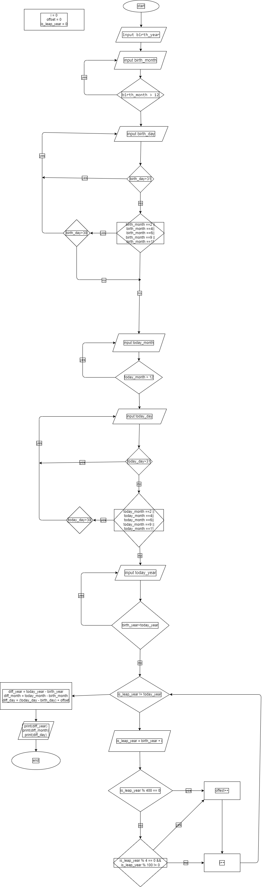

# Problem 9 : Exact Age in days, months, and years from DOB

NOTE: For this problem you may ignore the leap years when calculating age but not when validating date of birth or current date.  

Mr. Bhoola is trying to figure out how old someone is, but he keeps getting confused! He needs your help. Your job is to create a solution that makes calculating ages super easy.
Here's what you need to do:

**GET THE DATES:**
First, you need to ask Mr. Bhoola for two dates: The person's Birthday: This is the date they were born. And Today's Date: You'll need to know what day it is right now.

**CHECK FOR MISTAKES: (THE VALIDATION STEP)**
Before you can calculate the age, you need to make sure the dates Mr. Bhoola gives you are correct. Think about these things: Are there too many days in the month? For example, April only has 30 days, so you can't have a date like April 31st. Is it a leap year? February has 29 days on a leap year, and 28 days otherwise!
Now, you can calculate the exact age.
*Bonus for also including leap year in the calculation.*

## LOGIC

1:jan = 31 days
2:feb = 28/19 days
3:mar = 31 days
4:apr = 30 days
5:may = 31 days
6:jun = 30 days
7:jul = 31 days
8:aug = 31 days
9:sep = 30 days
10:oct = 31 days
11:nov = 30 days
12:dec = 31 days

## pseudocode

```pseudocode

// ______________INPUT 1______________
// birth date INPUT

input birth_year
input birth_month
input birth_day

while birth_month > 12:
    print "incorrect month"
    input birth_month
endwhile

// validation for months with only 30 days
if birth_month ==2 || birth_month ==4|| birth_month ==6|| birth_month ==9 || birth_month ==11:
    while birth_day>30:
        print "incorrect day"
        input birth_day
    endwhile
endif

// validation for all months
while birth_day>31:
        print "incorrect day"
        input birth_day
endwhile

// ______________INPUT 2______________
// today date INPUT

input today_year
input today_month
input today_day

while (today_month > 12){
    print "incorrect month"
    input today_month
}


// validation for months with only 30 days
if (today_month ==2 || today_month ==4|| today_month ==6|| today_month ==9 || today_month ==11){
    while (today_day>30){
        print "incorrect day"
        input today_day
    }
}


// validation for all months
while (today_day>31){
    print "incorrect month"
    input today_day
}


// validation for whether birth_year is lesser than today_year

while (birth_year>today_year){
    print "incorrect year"
    input today_year
}

// ______________LEAP-YEAR______________

// accounting for leap years b/w birth_year and `today_year`, 
// the amount of leap years present will add one more extra day to `offset` which will be added to `diff_day`

i=0
is_leap_year = 0
while (is_leap_year != today_year){
    is_leap_year = birth_year + i
    if (is_leap_year % 400 == 0){
        offset = offset + 1
    }
    else if (is_leap_year % 4 == 0 && is_leap_year % 100 != 0){
        offset = offset + 1
    }
    i = i + 1
}

diff_year = today_year - birth_year
diff_month = today_month - birth_month
diff_day = (today_day - birth_day) + offset

// ______________OUTPUTS______________

print(diff_year)
print(diff_month)
print(diff_day)


```

## Flowchart


