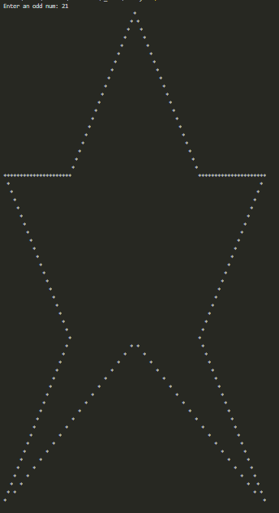

# Printing Star Pattern for Odd Values of N

This program generates a star pattern based on an odd value of `N` provided by the user. The pattern consists of three main sections: the top, the middle, and the bottom. The overall structure of the star is formed by printing triangles and spaces in a specific arrangement. The program ensures that the value of `N` is always odd and greater than or equal to 3.

### Description of the Star Pattern:

- **Top**: A triangle with a star at the tip and an expanding set of inner spaces.
- **Middle**: The widest part of the pattern, where two solid lines of stars are printed, with a hollow triangle in between.
- **Bottom**: A series of smaller hollow triangles, with stars appearing in specific positions to form the right leg of the star.
- The program dynamically adjusts the number of spaces and stars based on the user’s input.

### Main Problems Faced:

1. **Alignment and Spacing**: One of the major challenges was handling the alignment and spacing of the stars and spaces, especially as the pattern grew larger. Ensuring that the stars were correctly placed relative to each other and that spaces were properly calculated required careful adjustment of the loop conditions.

2. **Edge Cases**: Dealing with small values of `N` (like 3) posed a challenge because the pattern for smaller values required a different handling of spaces. This was resolved by adjusting the print logic in the program for small input values.

3. **Complexity of Pattern Segments**: The top, middle, and bottom portions of the star have distinct characteristics and involve different printing logic. Ensuring that these segments transitioned smoothly without disrupting the pattern was a key challenge. Each segment required careful fine-tuning, especially for larger values of `N`.

4. **User Input Validation**: The program requires the user to input an odd value for `N`. This meant adding logic to handle invalid inputs and prompt the user until they provide a valid odd number.

The program works well for any odd value of `N`, and the result is an accurately printed star pattern.

|7|21|
|-|-|
|||
