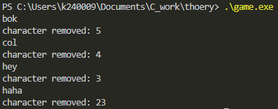

## Word Compression Program

### Program Overview
This program is designed to optimize word storage by minimizing excessive character repetitions. In particular, it compresses words by reducing consecutive duplicate characters to a single instance. Additionally, it calculates and outputs the number of characters removed during the compression. This tool is ideal for a text-processing company focused on minimizing storage space used by repetitive text patterns in large documents.

### Input and Expected Output

**Input**: A list of words containing consecutive duplicate characters, such as:
- `"booooook"`
- `"coooool"`
- `"heeeey"`

**Expected Output**: A compressed list where consecutive duplicates are reduced to single characters, along with a count of removed characters:
- `"booooook"` -> `"bok"` (Characters removed: 5)
- `"coooool"` -> `"col"` (Characters removed: 4)
- `"heeeey"` -> `"hey"` (Characters removed: 3)

### Logic Explanation

1. **Initialize Variables**: 
   - `curr_char` and `prev_char` are used to compare the current and previous characters in the string.
   - `j` is used to count the number of characters removed.
2. **Character Compression**:
   - Loop through each character of the word.
   - If the current character is the same as the previous one, increment the removal counter and skip it.
   - If it is different, print the character.
3. **Output Results**:
   - The compressed word and the total characters removed are displayed for each word.

### Challenges Faced
One challenge was managing edge cases, such as very long strings with repetitive characters, which required precise handling to ensure accurate counting and compression. Additionally, the function needed to handle varying word lengths and dynamically calculate character removal while maintaining the correct order of non-duplicate characters.

### Example Showcase
Here’s an example of how the program processes and outputs the compressed words:

---

This image illustrates the program output, showing the compressed words and the count of removed characters for each.