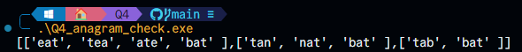

### Program Overview

This program groups scrambled (anagram) transactions that represent identical customer activities, as certain database entries have been duplicated and appear in various orders due to system errors. To achieve this, it identifies and categorizes anagrams—strings containing the same characters but arranged differently—so that identical transactions are grouped together.

### Input and Expected Output

**Input**: A list of transaction strings that may contain scrambled duplicates, such as:
- `["eat", "tea", "tan", "ate", "nat", "bat"]`

**Expected Output**: A list of grouped anagram sets:
- `[["bat"], ["tan", "nat"], ["eat", "tea", "ate"]]`

### Solution Logic

1. **Sorting for Anagram Detection**:
   - To check if two strings are anagrams, the `anagram_checker()` function first sorts the characters within each string. If the sorted strings match, they are considered anagrams.

2. **Grouping Process**:
   - The main program iterates through each string in the array.
   - For each string, it checks all subsequent strings in the array to find any anagrams.
   - If two strings are identified as anagrams, they are grouped together.
   - A separate array, `anagram_stamp`, keeps track of which strings have already been identified as anagrams to avoid redundant processing.

3. **Printing the Groups**:
   - The program formats and outputs each group of anagrams. To maintain the correct format, a workaround is used to avoid printing extra commas.

### Challenges Faced

The primary challenge was handling each string's temporary modification in the `anagram_checker()` function to preserve the original array content for subsequent checks. Additionally, creating a formatted output with the correct groupings required precise indexing to avoid adding extra characters or missing elements.

### Example Showcase

Here's an example of the output generated by the program, showing the grouped transactions:

