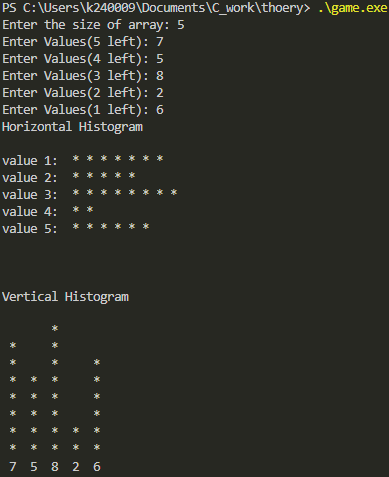

# Histograms

we will decrement in order to start printing the largest values first
    
    when arr_val>=i print '*'

    i=5      *
    i=4      *   *
    i=3    * *   *
    i=2    * *   *
    i=1    * * * *
           3 5 1 4

