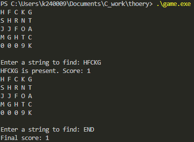

# String Search in a 2D Character Grid

In this program, a 6x5 grid is generated with random alphabetic characters, except for the last row, which is populated with the last four digits of the student's ID. The player is asked to input strings to search for in the grid, either horizontally (left-to-right) or vertically (top-to-bottom). Each time a string is found in the grid, the player’s score increases by 1. If the string is not found, the score decreases by 1. The game continues until the player types "END", at which point the program outputs the final score.

### Features:

- **Grid Generation**: 
  - A 6x5 grid is created, filled with random alphabet characters. The last row is populated with the last four digits of the student's ID, making it a personalized feature of the grid.
  
- **String Search**:
  - The player inputs a string to search for within the grid. The string can be searched from left to right across rows and from top to bottom in columns.

- **Score Management**:
  - For each valid input, the score is updated. A correct guess increases the score by 1, and an incorrect guess decreases the score by 1. The score is printed after each input.

- **End Condition**: 
  - The game terminates when the player types "END". The final score is displayed at that time.

### Example Flow

1. **Game Interaction**:
    - **Search String**: "FAST"
      - Output: `"FAST is present. Score: 1"`
    - **Search String**: "EAT"
      - Output: `"EAT is present. Score: 2"`
    - **Search String**: "GREAT"
      - Output: `"GREAT is not present. Score: 1"`

2. The game continues, and the user can end the game by typing "END".

### Key Challenges

- **Search Algorithm**:
  - The main difficulty in implementing the solution was to create an efficient search mechanism that checks both horizontally and vertically for the input string. This required iterating through every possible row and column and comparing characters sequentially.
  
- **Score Management**:
  - Properly managing the score based on whether the input string was found or not was another key challenge. The score needed to be updated after each input and displayed correctly to the player.

- **Grid Management**:
  - Generating a grid with random characters and ensuring that the last row contains the student's ID digits required careful attention to how the grid was populated and displayed.

### Final Thoughts

This program serves as an interactive way to search for strings in a 2D array while also maintaining a score system based on user input. It helps improve familiarity with multidimensional arrays, string manipulation, and game design principles in C programming.

