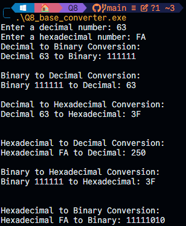

# Numerical Conversion Program in C

This C program performs various numerical base conversions. It includes functions to convert between binary, decimal, and hexadecimal number systems. The user is prompted to enter values for the conversions, and the program outputs the equivalent values in different bases. The key functions are `bin_to_dec`, `dec_to_bin`, `dec_to_hex`, `hex_to_dec`, `bin_to_hex`, and `hex_to_bin`. Each function is responsible for handling the respective conversion from one number system to another.

### Key Features

- **Binary to Decimal Conversion**: Converts a binary number (base 2) to its decimal equivalent (base 10).
- **Decimal to Binary Conversion**: Converts a decimal number (base 10) to its binary equivalent (base 2).
- **Decimal to Hexadecimal Conversion**: Converts a decimal number (base 10) to its hexadecimal equivalent (base 16).
- **Hexadecimal to Decimal Conversion**: Converts a hexadecimal number (base 16) to its decimal equivalent (base 10).
- **Binary to Hexadecimal Conversion**: Converts a binary number (base 2) to its hexadecimal equivalent (base 16).
- **Hexadecimal to Binary Conversion**: Converts a hexadecimal number (base 16) to its binary equivalent (base 2).

### Main Problems Encountered

While implementing the conversion functions, the main challenges were related to handling multiple conversions in one program. The following issues were encountered:

1. **Indexing and Array Management**: When converting from hexadecimal to decimal, indexing played a crucial role. Storing hexadecimal digits in an array and performing calculations with their powers of 16 required careful management of indices and array boundaries.

2. **Recursive Function for Decimal to Binary Conversion**: The recursive function `dec_to_bin` worked fine but required additional care to ensure that the number was divided correctly, and the binary result was constructed in the correct order.

3. **Input Handling**: Ensuring that the user inputs valid binary and hexadecimal values presented some challenges. While the program reads user input, additional validation checks would be necessary for robustness in production code.

4. **Hexadecimal to Binary Conversion**: This was a bit tricky because hexadecimal values are represented as a single character but need to be expanded to their 4-bit binary equivalents, and managing the transitions between these conversions required precise handling of bit shifts and remainders.

Overall, the implementation successfully handles base conversions, but additional error checking and validation can be added to handle edge cases and improve robustness.

