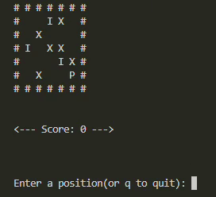

# Simple Grid-based Adventure Game in C

This C program simulates a simple adventure game where the player navigates a 5x5 grid. The grid consists of various elements: obstacles ('X'), items ('I'), and an empty space (' '). The player ('P') can move in four directions (up, down, left, right) and collect items. The objective is to collect all items (represented by 'I') and increase the score while avoiding obstacles. The game ends when the player collects all items or chooses to quit.

### Key Features:
- The grid is a 5x5 matrix, with each cell representing different entities: obstacles ('X'), items ('I'), and the player ('P').
- The player can move by entering commands ('W' for up, 'S' for down, 'A' for left, 'D' for right, and 'Q' to quit).
- The player's position is updated based on valid inputs, and items are collected when the player moves onto them.
- The game continues until the player collects all items or chooses to quit.

### Main Problems Faced:
While implementing this game, a few challenges were encountered:

1. **Handling Multiple Entities**: The game needed to track the positions of several entities (obstacles, items, and the player) on the grid. This required efficient handling of the grid's 2D structure and accurate updates of each entity's position.

2. **User Input Validation**: Ensuring that the player can only move within the grid's bounds and avoid obstacles ('X') required careful validation of the input. Additionally, managing user input (especially for multiple characters such as 'w', 'a', 's', 'd', and 'q') proved tricky, especially with input buffering issues.

3. **Grid Display**: The grid was printed after each move, which meant that the grid had to be redrawn correctly every time the player moved. This required managing the clearing and updating of the grid efficiently while maintaining the player’s position and item collection.

4. **Edge Case Handling**: Moving beyond the grid's boundaries or onto obstacles could cause errors, so extra checks were required to ensure the game remained functional in such cases.

Despite these challenges, the game runs smoothly and provides a simple yet engaging gameplay experience.

|||
|-|-|