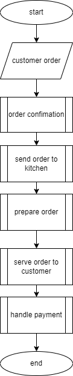
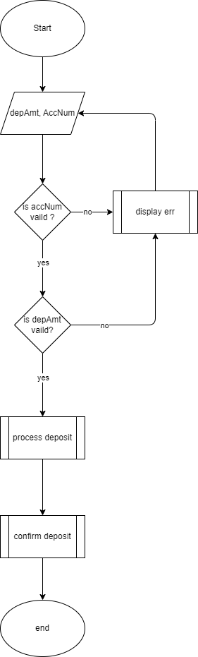
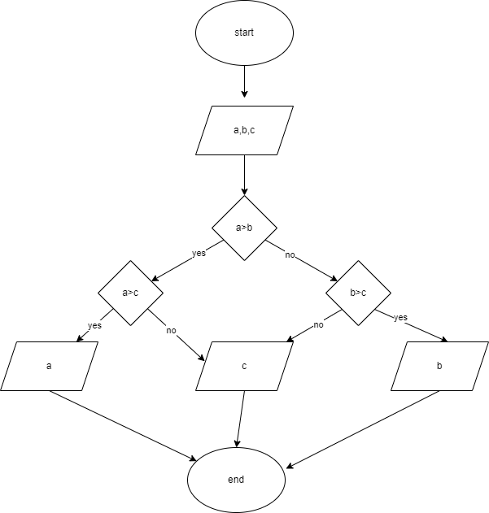
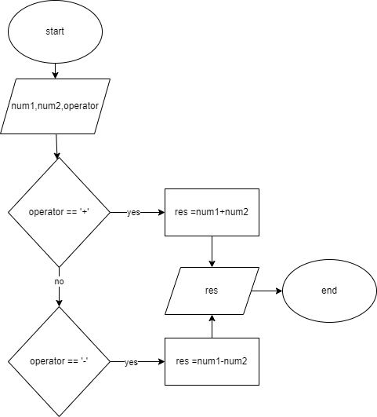
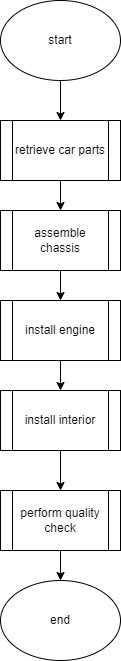
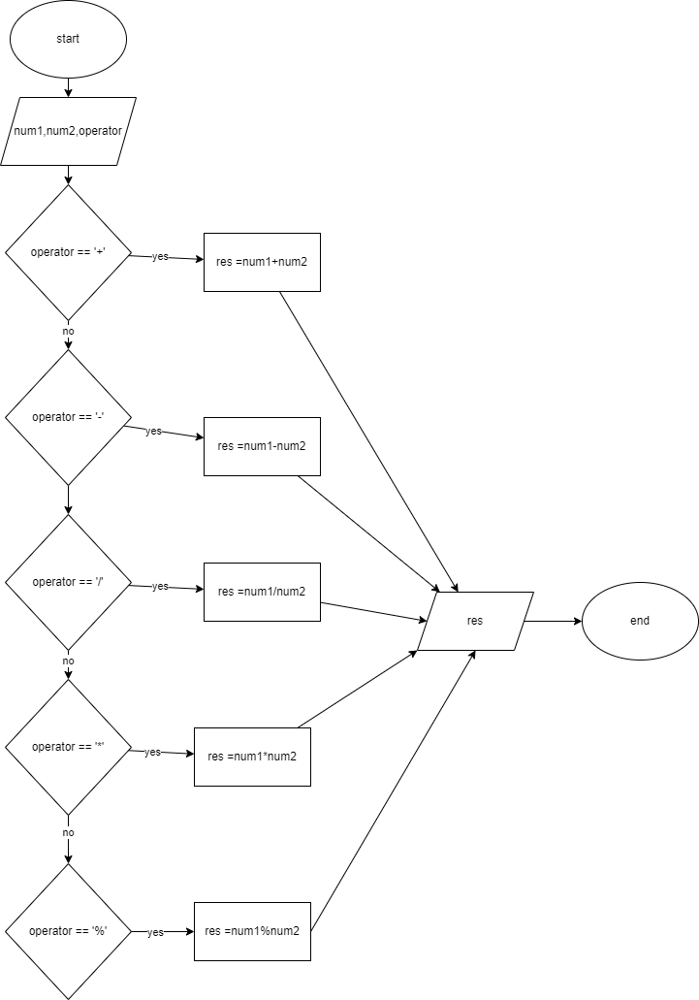

# CHECKING OUT BRANCH FEATURE!! checking it again
# Tasks

## Task 1

 Design a flowchart, Pseudo code, Algorithm for processing a customer order at a restaurant,
including handling special requests (Like add on).

### Task 1-Flowchart



### Task 1-Algorithm

1. start
2. take customer order
3. confirm customer order
4. forward order to kitchen
5. prepare order
6. serve order to customer
7. handle payment
8. end

### task 1-pseudocode

```pseudocode
input order
test = validate(order)
if test == true
    forward_to_kitchen(order)
    prepare(order)
    serve(order)
    handle(payment)
endif
```

## Task 2

 Design a flowchart, Pseudocode, Algorithm for handling a customer's deposit transaction at a
bank, including checks for account validity and deposit amount conditions.

### Task2-Flowchart



### Task2-Algorithm

1. input depositAmount, accountNumber
2. validate accountNumber
3. if validation is successful  move to step 4, else move to step 1
4. validate depositAmount
5. if validation is successful  move to step 6, else move to step 1
6. process deposit
7. confirm deposit
8. end

### Task2-pseudocode

```pseudocode
input depAmt
input accNum
test_1 = validate(depAmt)
test_2 = validate(accNum)
if test_1 == true and test_2 == true:
    process(depAmt)
    confirm(depAmt)
endif
```

## Task 3

Design a flowchart, Pseudocode, Algorithm to determine which of three provided numbers is the
greatest.

### Task3-Flowchart



### Task3-Algorithm

1. input a,b,c
2. if a>b and a>c is true
3. print a
4. else print c
5. if a>b and b>c is true
6. print b
7. else print c
8. end

### task3-pseudocode

```pseudocode
input a
input b
input c
if a>b and a>c:
    print a
else:
    print c
if a>b and b>c:
    print b
else:
    print c
```

## Task 4

Implement an algorithm where the user enters a number, and an appropriate month is
displayed.

### Task4-algorithm

```pseudocode
Start
  Input monthNumber
  
  If monthNumber == 1
    Display "January"
  Else If monthNumber == 2
    Display "February"
  Else If monthNumber == 3
    Display "March"
  Else If monthNumber == 4
    Display "April"
  Else If monthNumber == 5
    Display "May"
  Else If monthNumber == 6
    Display "June"
  Else If monthNumber == 7
    Display "July"
  Else If monthNumber == 8
    Display "August"
  Else If monthNumber == 9
    Display "September"
  Else If monthNumber == 10
    Display "October"
  Else If monthNumber == 11
    Display "November"
  Else If monthNumber == 12
    Display "December"
  Else
    Display "Invalid month number"
  End If
End

```

## Task 5

Create pseudocode a small calculator which only does ‘+’ or ‘-‘Operations. (Hint: Take three
variable inputs with one being used for the operator)

### Task5-Flowchart



### Task5-Algorithm

```pseudocode
Start
  Input num1
  Input num2
  Input operator
  
  
  If operator == "+":
    result = num1 + num2
    Display  result
  Else If operator == "-"
    result = num1 - num2
    Display  result
  Else
    Display "Invalid operator. Please use '+' or '-'"
  End If
End

```

## Task 6

### task6-flowchart

 You are working at Toyota Indus Motors and want to assemble a car.
Design a flowchart with proper process modules and decision structures to replicate a pipeline production.



## Task 7

Implement an algorithm for making a simple calculator with all the operators (+,-,*,/,%)

### task7- flowchart



### task 7-pesudocode

```pseudocode
Start
  Input num1
  Input num2
  Input operator
  
  
  If operator == "+":
    result = num1 + num2
    Display  result
  Else If operator == "-"
    result = num1 - num2
    Display  result
  Else If operator == "*"
    result = num1 * num2
    Display  result
  Else If operator == "/"
    result = num1 / num2
    Display  result
  Else If operator == "%"
    result = num1 % num2
    Display  result
  Else
    Display "Invalid operator. try again"
  End If
End

```
